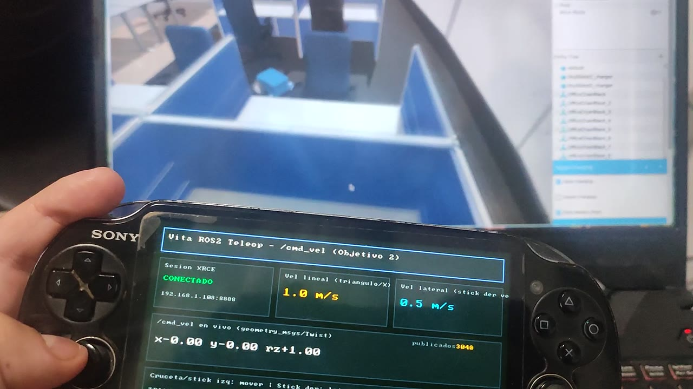

# PS Vita ↔ ROS2

Convertir una **PS Vita 1000** en un nodo real del ecosistema **ROS2 Jazzy**:
publica y recibe topics vía micro-ROS (XRCE-DDS) sobre WiFi/UDP, con cada
módulo de bajo nivel implementado **dos veces** (Rust y C/C++) tras un mismo
header C. Proyecto experimental de largo plazo con vocación de publicarse.

**Estado:** Objetivo 1 (topics) y **Objetivo 2 (teleoperación) CERRADOS y
validados en hardware real** · Objetivos 3/4 (mini-rviz 3D) **en ejecución**
con las dos primeras etapas hechas · web del proyecto operativa (taller,
monitor, visor 3D). Detalle vivo en
[`docs/06-bitacora-estado.md`](docs/06-bitacora-estado.md).

---

## 🎮 La Vita controlando un robot (2026-07-10)

Primer vídeo del hito del Objetivo 2: la app **"Vita ROS2 Teleop"** corriendo
en la consola, publicando `geometry_msgs/Twist` en `/cmd_vel` a ~20 Hz por
WiFi (XRCE-DDS → agente micro-ROS → grafo ROS2 Jazzy) y moviendo un robot
móvil en vivo, con la UI declarativa mostrando la conexión, las escalas de
velocidad y el Twist publicado:

[](media/2026-07-10-primer-control-robot-cmd_vel.mp4)

*(clic en la imagen para ver el vídeo — `media/…-cmd_vel.mp4`, 1 min)*

---

## Hitos conseguidos

| Fecha | Hito |
|---|---|
| 2026-06-28 | Cliente XRCE y los 3 módulos duales cross-compilan; `.vpk` C y Rust |
| 2026-07-01 | **Incógnita dura resuelta en hardware**: sesión XRCE Vita↔agente estable (el muro era la versión del protocolo, v2.4.3) + criterios de la Fase 1 en vivo |
| 2026-07-06 | Primer hito de la web: comparador C↔Rust, dashboard, visor URDF 3D, compilador `.vpk` y debug desde el navegador |
| 2026-07-07 | UI declarativa en la app (JSON → codegen → intérprete) + editor visual web |
| 2026-07-07 | **Objetivo 2 cerrado**: teleop `/cmd_vel` con sticks/botones (39 checks host del mapeo) |
| 2026-07-10 | **Objetivo 3 respondido con evidencia** (rviz2 no portable → ADR 0006: mini-rviz propio) |
| 2026-07-10 | **Modo VIZ 3D en la consola** (vitaGL, ADR 0007) + IP del agente editable desde la Vita + **robot móvil real controlado** (vídeo de arriba) |

---

## Máquinas

| Rol | Equipo | IP | Función |
|---|---|---|---|
| **Taller** | Laptop (este repo) | 192.168.1.108 | Código portable, docs, web, MCP, tests host. Corre el **agente micro-ROS** y recibe el netlog (IP por defecto de la app; editable desde la propia Vita al arrancar). |
| **Desarrollo** | PC CachyOS | 192.168.1.65 | VitaSDK: cross-compilación, empaquetado `.vpk` y deploy FTP. También puede correr el agente para probar sin la laptop. |
| **Objetivo** | PS Vita 1000 | (WiFi) | ARM Cortex-A9 ×4 32-bit, 512 MB RAM. Homebrew vía VitaSDK. |

**Regla de frontera:** en la laptop se escribe y verifica todo lo verificable
en host (módulos con paridad C/Rust, lógica del teleop y de la cámara 3D,
MCP, web); **ninguna toolchain del proyecto se instala en la laptop**. La
compilación para la Vita ocurre en el PC.

---

## Mapa del repo

```
PSVita-ROS/
├── docs/                  # 00-11 + adr/ (7 ADRs) + rust/ + guias-vita/ + superpowers/
├── modules/               # los 3 módulos duales (paridad C/Rust en host)
│   ├── mem-pool/          #   asignador de bloques fijos sin malloc
│   ├── net-udp/           #   sockets UDP: sceNet (Vita) / POSIX (host)
│   └── microros-transport/#   los 4 callbacks XRCE (la ex-incógnita dura)
├── vita-app/              # app "Vita ROS2 Teleop" (.vpk, se compila en el PC)
│   ├── src/               #   main + teleop + UI declarativa (vitaGL) + config IP
│   ├── src/viz/           #   mini-rviz: cámara orbital + escena 3D (Objetivos 3/4)
│   ├── ui/layout.json     #   la pantalla, editable desde la web (/taller/ui)
│   └── scripts/           #   checks host + cross-compilación del cliente XRCE
├── mcp/ros2-introspection/# servidor MCP: el grafo ROS2 visible para Claude
├── media/                 # fotos y vídeos de los hitos
├── skills/                # skills de Claude Code para el PC
├── tools/                 # run-parity-tests.sh, netlog-listen.sh, env del PC
└── web/                   # Astro+SQLite+Docker: guías, progreso, monitor,
                           # dashboard, comparador C↔Rust, visor 3D URDF,
                           # taller (compilar .vpk, deploy FTP, editor de UI)
```

Cada módulo y la app tienen su propio `README.md` con API, diseño y estado.

---

## Verificación rápida (laptop o PC)

```bash
tools/run-parity-tests.sh                # paridad C/Rust de los 3 módulos
bash vita-app/scripts/check-teleop.sh    # mapeo mandos -> Twist (39 checks)
bash vita-app/scripts/check-viz-host.sh  # cámara orbital del mini-rviz
bash vita-app/scripts/check-config.sh    # persistencia de la IP del agente
bash vita-app/scripts/check-ui-layout.sh # codegen de la UI declarativa
cd mcp/ros2-introspection && .venv/bin/python -m pytest tests/ -q
cd web && docker compose up -d --build   # la web en localhost:4321
```

## Compilar para la Vita (PC)

```bash
source tools/env-devpc.sh                # VitaSDK + cmake + rustup del repo
cd vita-app
./scripts/build-xrce-client-vita.sh      # una vez: micro-XRCE para armv7/newlib
cmake -DCMAKE_TOOLCHAIN_FILE=$VITASDK/share/vita.toolchain.cmake \
      -DVITA_IMPL=c -B build-c && cmake --build build-c    # -> .vpk
# deploy: curl -T build-c/vita-ros2-hello.vpk ftp://<ip-vita>:1337/ux0:/
```

`-DVITA_IMPL=rust` genera la variante con los módulos en Rust (ADR 0003).
La IP del agente por defecto se hornea con `-DAGENT_IP=…`, pero desde la
v03.00 **se puede cambiar desde la propia consola** al arrancar la app.

---

## Documentación

| Doc | Contenido |
|---|---|
| `docs/00-vision-y-objetivos.md` | Los 6 objetivos y las restricciones |
| `docs/01` … `docs/05` | Hardware, arquitectura micro-ROS, estrategia dual, investigación rviz2, setup del PC |
| `docs/06-bitacora-estado.md` | **Dónde estamos y próximos pasos exactos** |
| `docs/09-objetivo2-control-robot.md` | Diseño del teleop `/cmd_vel` (mapeo de mandos) |
| `docs/10-plan-objetivos-3-4.md` | **Guía operativa de los Objetivos 3/4** (etapas A-F) |
| `docs/11-diseno-mini-rviz.md` | Diseño del mini-rviz y formato VBM |
| `docs/adr/0001-0007` | Decisiones registradas (toolchain, transporte, Rust, vpk, UI, rviz2→mini-rviz, vitaGL) |
| `docs/rust/` | Aprendizaje de Rust ligado al código del repo |
| `docs/guias-vita/` | Instalar el homebrew de la consola (también en la web) |

Toda la documentación se publica también en la **web del proyecto**
(`cd web && docker compose up -d --build` → `localhost:4321`).

## Transferencia laptop ↔ PC

Por **git**: `https://github.com/Jcrex/PSVita-ROS.git` (`git push` aquí,
`git pull` en el PC).
